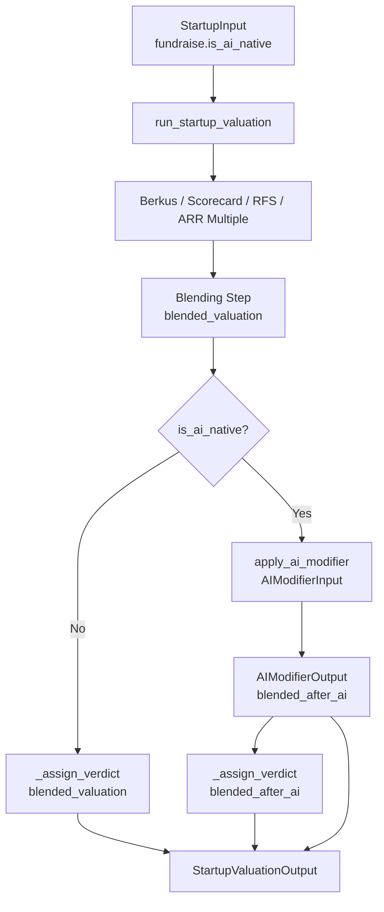
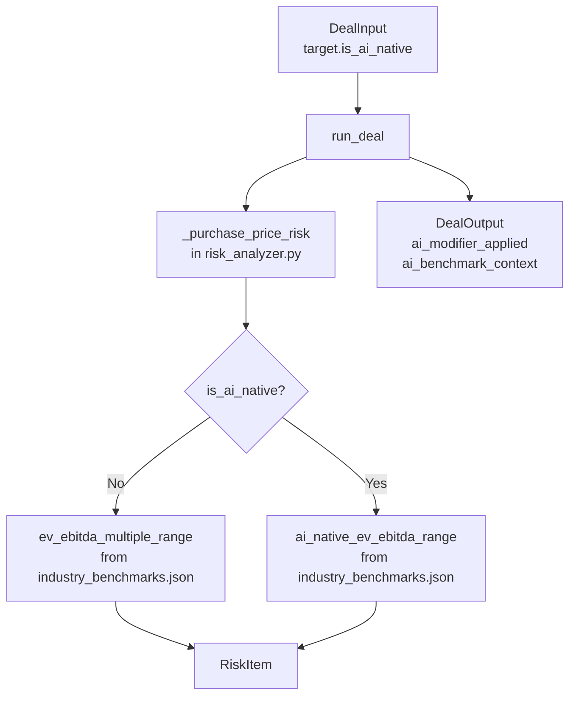

# Design Document — AI Valuation Modifier Toggle

## Overview

The AI Valuation Modifier Toggle is a purely additive layer that applies a research-backed premium to blended valuations for AI-native companies. It sits alongside the vertical selector in both the Startup Valuation and M&A flows.

The modifier never touches core financial math (EPS, accretion/dilution, IRR). It only affects benchmarking context, scorecard language, and verdict thresholds. The deterministic engine output remains the source of truth; the AI modifier augments analysis without overwriting computed numbers.

The premium is graduated: a four-question AI Characteristics Assessment produces an `ai_native_score` in [0.0, 1.0], and the premium scales linearly with that score. A company that answers 2 of 4 questions "yes" receives exactly half the full vertical premium.

---

## Architecture

### Data Flow — Startup Engine



The modifier is called **after blending and before `_assign_verdict()`**. When applied, `blended_after_ai` replaces `blended_valuation` as the value passed to both `_assign_verdict()` and `_build_scorecard()`. The original pre-modifier value is preserved in `blended_before_ai` for transparency.

### Data Flow — M&A Engine



The M&A integration is narrower: `is_ai_native` on `TargetProfile` switches the benchmark range used in `_purchase_price_risk()` and populates two new fields on `DealOutput`. Core financial math (income statement, accretion/dilution, IRR) is untouched.

### Module Dependency

```
ai_modifier.py
  ├── imports: json, os, logging, pydantic
  ├── NO import from startup_engine.py
  └── NO import from financial_engine.py

startup_engine.py
  └── imports apply_ai_modifier from ai_modifier.py

risk_analyzer.py (M&A)
  └── reads ai_native_ev_ebitda_range directly from benchmarks dict
      (no import of ai_modifier.py needed for M&A)
```

`ai_modifier.py` is a standalone module. The M&A engine reads AI-native benchmark ranges directly from the already-loaded `industry_benchmarks.json` dict — it does not call `apply_ai_modifier()` because there is no blended valuation to modify in the M&A flow; only the benchmark context changes.

---

## Components and Interfaces

### `ai_modifier.py` — Public Interface

```python
def apply_ai_modifier(inp: AIModifierInput) -> AIModifierOutput:
    """
    Apply the AI-native premium to a blended startup valuation.
    Never raises — returns AIModifierOutput with ai_modifier_applied=False on any error.
    """
```

**`AIModifierInput`** (Pydantic model):

| Field | Type | Description |
|---|---|---|
| `is_ai_native` | `bool` | Whether the AI toggle is ON |
| `ai_native_score` | `float` | Score in [0.0, 1.0] from 4-question assessment |
| `vertical` | `str` | StartupVertical enum value |
| `blended_valuation` | `float` | Pre-modifier blended value in USD millions |

**`AIModifierOutput`** (Pydantic model):

| Field | Type | Description |
|---|---|---|
| `blended_after_ai` | `float` | Post-modifier value (equals `blended_valuation` when not applied) |
| `ai_premium_multiplier` | `float \| None` | The effective multiplier applied (e.g. 0.9 for 90% premium at score=1.0) |
| `ai_modifier_applied` | `bool` | True only when a non-zero premium was actually applied |
| `ai_premium_context` | `str \| None` | Human-readable explanation or warning string |

### `ai_toggle_config.json` — Schema

```json
{
  "frozen_on": ["ai_ml_infrastructure", "ai_enabled_saas"],
  "frozen_off": ["construction", "restaurants", "retail", "real_estate",
                  "agriculture", "waste_management", "staffing"],
  "default_on": ["defense_tech", "healthtech", "biotech_pharma", "developer_tools"],
  "default_off": ["b2b_saas", "fintech", "deep_tech_hardware", "consumer",
                   "climate_energy", "marketplace", "vertical_saas"],
  "vertical_premiums": {
    "defense_tech":      1.5,
    "healthtech":        1.0,
    "biotech_pharma":    0.8,
    "b2b_saas":          0.8,
    "vertical_saas":     0.7,
    "developer_tools":   0.5,
    "fintech":           0.6,
    "climate_energy":    0.5,
    "consumer":          0.4,
    "deep_tech_hardware":0.4,
    "marketplace":       0.3
  }
}
```

The `vertical_premiums` values are the `base_premium` at `ai_native_score = 1.0`. A `defense_tech` company with score=1.0 receives a 1.5× premium factor, meaning `blended_after_ai = blended_valuation × (1 + 1.5) = blended_valuation × 2.5`. This matches the 2.5x multiplier specified in requirements.

`frozen_on` verticals always return `ai_modifier_applied=False` — their benchmarks already price in AI-native status. `frozen_off` verticals are M&A industries where AI premium does not apply; the startup vertical list has no `frozen_off` entries.

### `industry_benchmarks.json` — Schema Addition

Each of the 21 M&A industry objects gains one new key:

```json
"Software / SaaS": {
  "ev_ebitda_multiple_range": { "low": 12, "median": 20, "high": 35 },
  "ai_native_ev_ebitda_range": { "low": 20, "median": 35, "high": 60 },
  ...
}
```

The `ai_native_ev_ebitda_range` values must be strictly higher than `ev_ebitda_multiple_range` for every industry. For industries where AI premium is minimal (e.g., Construction), the uplift is small but still positive.

### Frontend Component — `StartupStep1b_AICharacteristics`

```
StartupStep1_Overview
  └── [below vertical selector]
      ├── AIToggleRow (toggle + frozen state tooltip)
      └── StartupStep1b_AICharacteristics  [shown when toggle ON and not frozen_on]
          ├── Question row 1: "AI/ML is the core product, not a feature..."
          ├── Question row 2: "The company has proprietary training data..."
          ├── Question row 3: "R&D spending is above 25% of revenue"
          ├── Question row 4: "The product improves with usage..."
          └── ScoreSummary: "3 / 4 — Strongly AI-Native"
```

Props interface:

```typescript
interface AICharacteristicsProps {
  answers: [boolean, boolean, boolean, boolean]
  onAnswerChange: (index: number, value: boolean) => void
  ai_native_score: number  // computed by parent from answers
}
```

The parent (`StartupStep1_Overview`) owns the answer state and passes it down. Score computation happens in the parent or hook: `score = answers.filter(Boolean).length / 4`.

---

## Data Models

### Backend Model Changes

**`startup_models.py` — `FundraisingProfile`** (add one field):

```python
is_ai_native: bool = Field(default=False, description="AI-native toggle — enables graduated premium layer")
```

**`startup_models.py` — `StartupValuationOutput`** (add five fields after `computation_notes`):

```python
# AI modifier outputs (all None when modifier not applied)
ai_modifier_applied: bool = Field(default=False)
ai_premium_multiplier: Optional[float] = Field(default=None, description="Effective premium factor applied")
ai_premium_context: Optional[str] = Field(default=None, description="Human-readable premium explanation")
blended_before_ai: Optional[float] = Field(default=None, description="Pre-modifier blended value, USD millions")
ai_native_score: Optional[float] = Field(default=None, description="Score from 4-question assessment [0.0–1.0]")
```

**`models.py` — `TargetProfile`** (add one field after `defense_profile`):

```python
is_ai_native: bool = Field(default=False, description="AI-native toggle for M&A target — switches to AI-native benchmark ranges")
```

**`models.py` — `DealOutput`** (add two fields after `defense_positioning`):

```python
ai_modifier_applied: bool = Field(default=False)
ai_benchmark_context: Optional[str] = Field(default=None, description="AI-native benchmark context string for purchase price risk section")
```

**`ai_modifier.py` — New Pydantic models**:

```python
class AIModifierInput(BaseModel):
    is_ai_native: bool
    ai_native_score: float = Field(ge=0.0, le=1.0)
    vertical: str
    blended_valuation: float = Field(gt=0.0)

class AIModifierOutput(BaseModel):
    blended_after_ai: float
    ai_premium_multiplier: Optional[float]
    ai_modifier_applied: bool
    ai_premium_context: Optional[str]
```

### Frontend Type Changes

**`frontend/src/types/startup.ts`**:

```typescript
// FundraisingProfile — add:
is_ai_native: boolean

// StartupValuationOutput — add:
ai_modifier_applied: boolean
ai_premium_multiplier: number | null
ai_premium_context: string | null
blended_before_ai: number | null
ai_native_score: number | null

// StartupState — add:
is_ai_native: boolean
ai_native_score: number
ai_answers: [boolean, boolean, boolean, boolean]
```

**`frontend/src/types/deal.ts`**:

```typescript
// TargetProfile — add:
is_ai_native: boolean

// DealOutput — add:
ai_modifier_applied: boolean
ai_benchmark_context: string | null
```

---

## Engine Integration Details

### Startup Engine — `run_startup_valuation()` Changes

The insertion point is immediately after the blending block and before the `_assign_verdict()` call. The existing blending logic is unchanged.

```python
# After blending produces `blended`:
blended_before_ai: Optional[float] = None
ai_mod_output: Optional[AIModifierOutput] = None

if inp.fundraise.is_ai_native:
    from .ai_modifier import apply_ai_modifier, AIModifierInput
    ai_mod_output = apply_ai_modifier(AIModifierInput(
        is_ai_native=True,
        ai_native_score=getattr(inp.fundraise, 'ai_native_score', 0.0),
        vertical=inp.fundraise.vertical.value,
        blended_valuation=blended,
    ))
    if ai_mod_output.ai_modifier_applied:
        blended_before_ai = blended
        blended = ai_mod_output.blended_after_ai

# _assign_verdict and _build_scorecard now receive the (possibly modified) blended
verdict, headline, subtext = _assign_verdict(blended, vdata, warnings)
investor_scorecard = _build_scorecard(inp, blended, vdata)
```

`ai_native_score` needs to be added to `FundraisingProfile` as well (alongside `is_ai_native`), since the score is computed in the frontend and sent as part of the input:

```python
# In FundraisingProfile:
ai_native_score: float = Field(default=0.0, ge=0.0, le=1.0,
    description="Score from 4-question AI assessment [0.0–1.0]")
```

The `StartupValuationOutput` is then constructed with the five new fields populated from `ai_mod_output`.

### M&A Engine — `_purchase_price_risk()` Changes

The function signature gains access to `deal.target.is_ai_native`. When true, it selects `ai_native_ev_ebitda_range` instead of `ev_ebitda_multiple_range`:

```python
if deal.target.is_ai_native:
    ev_range = ind.get("ai_native_ev_ebitda_range") or ind.get("ev_ebitda_multiple_range", {})
    context_prefix = "AI-native"
else:
    ev_range = ind.get("ev_ebitda_multiple_range", {})
    context_prefix = None
```

The `run_deal()` function sets `ai_modifier_applied` and `ai_benchmark_context` on `DealOutput` based on whether `target.is_ai_native` is True and whether an AI-native range was found.

For the defense industry specifically, when `target.is_ai_native=True` and `target.defense_profile` is present, the engine additionally references `defense_specific.ai_native_ev_revenue` from the benchmarks for revenue multiple context (this field will be added to the defense section of `industry_benchmarks.json`).

### `apply_ai_modifier()` — Premium Formula

```
base_premium = vertical_premiums[vertical]   # from ai_toggle_config.json
premium = base_premium × ai_native_score
blended_after_ai = blended_valuation × (1 + premium)
```

Decision table:

| Condition | `ai_modifier_applied` | `blended_after_ai` |
|---|---|---|
| `is_ai_native=False` | `False` | `blended_valuation` |
| `is_ai_native=True`, `score=0.0` | `False` | `blended_valuation` |
| `is_ai_native=True`, `score>0.0`, non-frozen vertical | `True` | `blended_valuation × (1 + base_premium × score)` |
| `is_ai_native=True`, `frozen_on` vertical | `False` | `blended_valuation` |
| Any error during computation | `False` | `blended_valuation` |

### Frontend Toggle State Machine

The toggle state is derived from the selected vertical on every vertical change:

```
vertical → frozen_on  → toggle locked ON,  assessment hidden
vertical → frozen_off → toggle locked OFF, assessment hidden
vertical → default_on → toggle ON  (user can override), assessment shown if ON
vertical → default_off→ toggle OFF (user can override), assessment shown if ON
```

When the vertical changes, the toggle resets to its default state and all four assessment answers reset to `false`.

`useStartupState` additions:

```typescript
is_ai_native: boolean          // persisted to localStorage
ai_native_score: number        // derived from ai_answers, also persisted
ai_answers: [boolean, boolean, boolean, boolean]  // persisted
```

Score label mapping (used by `StartupStep1b_AICharacteristics`):

| `ai_native_score` | Label |
|---|---|
| 1.0 or 0.75 | "Strongly AI-Native" |
| 0.5 | "Moderately AI-Native" |
| 0.25 | "Marginally AI-Native" |
| 0.0 | "Not AI-Native" |

---

## Correctness Properties

*A property is a characteristic or behavior that should hold true across all valid executions of a system — essentially, a formal statement about what the system should do. Properties serve as the bridge between human-readable specifications and machine-verifiable correctness guarantees.*

### Property 1: Backward Compatibility — Both Engines

*For any* valid `StartupInput` or `DealInput` where `is_ai_native` is `False` (the default), the engine output must be byte-for-byte identical to the pre-feature baseline. No new fields on the output models affect existing fields when the modifier is not applied.

**Validates: Requirements 13.1, 13.2, 3.4, 5.5**

### Property 2: Graduated Premium Formula

*For any* non-frozen startup vertical with a defined `base_premium`, any `ai_native_score` in (0.0, 1.0], and any positive `blended_valuation`, `apply_ai_modifier()` must return `blended_after_ai = blended_valuation × (1 + base_premium × ai_native_score)`. The premium scales linearly with the score — a score of 0.5 produces exactly half the premium of a score of 1.0.

**Validates: Requirements 3.6, 3.7**

### Property 3: Frozen-On Vertical Pass-Through

*For any* input where `vertical` is in the `frozen_on` set (`ai_ml_infrastructure`, `ai_enabled_saas`), regardless of `is_ai_native` value or `ai_native_score`, `apply_ai_modifier()` must return `ai_modifier_applied=False` and `blended_after_ai` equal to `blended_valuation`.

**Validates: Requirements 3.8**

### Property 4: Zero-Score No-Op

*For any* vertical and any `blended_valuation`, when `is_ai_native=True` and `ai_native_score=0.0`, `apply_ai_modifier()` must return `ai_modifier_applied=False` and `blended_after_ai` equal to `blended_valuation`.

**Validates: Requirements 3.5**

### Property 5: No-Exception Guarantee

*For any* input to `apply_ai_modifier()` — including malformed verticals, out-of-range scores, or zero/negative valuations — the function must return an `AIModifierOutput` without raising an exception. Error cases must set `ai_modifier_applied=False` and populate `ai_premium_context` with a descriptive warning.

**Validates: Requirements 3.9**

### Property 6: Config Completeness — Every Vertical in Exactly One Category

*For any* value in the `StartupVertical` enum, it must appear in exactly one of the four categories (`frozen_on`, `frozen_off`, `default_on`, `default_off`) in `ai_toggle_config.json`. No vertical may be absent or duplicated.

**Validates: Requirements 1.2**

### Property 7: AI-Native Benchmark Uplift Invariant

*For every* industry in `industry_benchmarks.json`, the `ai_native_ev_ebitda_range.median` must be strictly greater than `ev_ebitda_multiple_range.median`, and the `ai_native_ev_ebitda_range` object must contain `low`, `median`, and `high` fields.

**Validates: Requirements 6.1, 6.2**

### Property 8: Score Computation Correctness

*For any* combination of four boolean answers, the computed `ai_native_score` must equal `(count of True answers) / 4`. This covers all 16 possible answer combinations including the all-yes (1.0) and all-no (0.0) edge cases.

**Validates: Requirements 7.3, 7.4, 7.5**

### Property 9: Score Label Monotonicity

*For any* `ai_native_score` in {0.0, 0.25, 0.5, 0.75, 1.0}, the label returned by the score-to-label mapping function must match the specification: 0.0 → "Not AI-Native", 0.25 → "Marginally AI-Native", 0.5 → "Moderately AI-Native", 0.75 → "Strongly AI-Native", 1.0 → "Strongly AI-Native".

**Validates: Requirements 9.2–9.7**

---

## Error Handling

All error handling follows the project convention: engines never raise exceptions.

| Error Condition | Behavior |
|---|---|
| `vertical` not found in `ai_toggle_config.json` | Treat as `default_off`; set `ai_premium_context` to warning string; log at WARNING level |
| `ai_native_score` outside [0.0, 1.0] | Clamp to range; add note to `ai_premium_context` |
| `blended_valuation` ≤ 0 | Return pass-through with `ai_modifier_applied=False`; log warning |
| `ai_toggle_config.json` missing or malformed | Module-level load fails; `apply_ai_modifier()` returns pass-through with warning for every call |
| `ai_native_ev_ebitda_range` absent for an M&A industry | Fall back to `ev_ebitda_multiple_range`; set `ai_benchmark_context` to fallback warning string |
| Any unexpected exception inside `apply_ai_modifier()` | Catch-all `except Exception`; return `AIModifierOutput(blended_after_ai=inp.blended_valuation, ai_modifier_applied=False, ai_premium_multiplier=None, ai_premium_context=f"AI modifier error: {e}")` |

The config file is loaded once at module import time (same pattern as `_BENCHMARKS` in `startup_engine.py`). If the file is missing, a module-level warning is logged and a sentinel empty config is used, causing all verticals to fall through to the "not found" path.

---

## Testing Strategy

### Unit Tests — `tests/test_ai_modifier.py`

Focused on `apply_ai_modifier()` in isolation:

- `is_ai_native=False` → pass-through for any vertical and valuation
- `ai_native_score=0.0` with `is_ai_native=True` → pass-through, `ai_modifier_applied=False`
- `frozen_on` vertical (`ai_ml_infrastructure`) with `is_ai_native=True`, `score=1.0` → pass-through
- `defense_tech` with `score=1.0` → `blended_after_ai = blended × 2.5` (1 + 1.5 premium)
- `defense_tech` with `score=0.5` → `blended_after_ai = blended × 1.75` (1 + 0.75 premium)
- Unknown vertical → returns pass-through with warning string in `ai_premium_context`
- Malformed input (negative valuation) → no exception raised

### Integration Tests — `tests/test_engine.py` additions

- Run `run_startup_valuation()` with `is_ai_native=True`, `ai_native_score=1.0`, `vertical=defense_tech` → verify `ai_modifier_applied=True`, `blended_before_ai` is set, `blended_valuation` in output equals `blended_after_ai`
- Run `run_startup_valuation()` with `is_ai_native=False` → verify all 143 existing test cases produce identical output

### Fixture — `tests/fixtures/ai_native_defense_deal.json`

A `DealInput` fixture representing a $40M revenue AI-native defense company:

```json
{
  "target": {
    "company_name": "Sentinel AI",
    "revenue": 40.0,
    "ebitda": 8.0,
    "industry": "Defense & National Security",
    "acquisition_price": 320.0,
    "is_ai_native": true,
    "defense_profile": { "is_ai_native": true, ... }
  }
}
```

Tests using this fixture:
- With `is_ai_native=True` → `ai_modifier_applied=True`, `ai_benchmark_context` is non-null string referencing AI-native defense peer multiples
- With `is_ai_native=False` → `ai_modifier_applied=False`, `ai_benchmark_context=None`, output identical to pre-feature baseline

### Property-Based Tests — `tests/test_ai_modifier_properties.py`

Uses **Hypothesis** (already available in the Python ecosystem; add to `dev` dependencies).

Each property test runs a minimum of 100 examples.

```python
# Tag format: Feature: ai-valuation-modifier, Property {N}: {property_text}

# Property 1: Backward Compatibility
@given(st.builds(StartupInput, ...))
# Feature: ai-valuation-modifier, Property 1: backward compatibility
def test_backward_compat_startup(inp):
    inp.fundraise.is_ai_native = False
    # output must match baseline

# Property 2: Graduated Premium Formula
@given(
    vertical=st.sampled_from(NON_FROZEN_VERTICALS),
    score=st.floats(min_value=0.01, max_value=1.0),
    valuation=st.floats(min_value=0.1, max_value=10000.0),
)
# Feature: ai-valuation-modifier, Property 2: graduated premium formula
def test_graduated_premium(vertical, score, valuation):
    base = config["vertical_premiums"][vertical]
    result = apply_ai_modifier(AIModifierInput(
        is_ai_native=True, ai_native_score=score,
        vertical=vertical, blended_valuation=valuation,
    ))
    expected = valuation * (1 + base * score)
    assert abs(result.blended_after_ai - expected) < 1e-9

# Property 3: Frozen-On Pass-Through
@given(
    vertical=st.sampled_from(["ai_ml_infrastructure", "ai_enabled_saas"]),
    score=st.floats(min_value=0.0, max_value=1.0),
    valuation=st.floats(min_value=0.1, max_value=10000.0),
)
# Feature: ai-valuation-modifier, Property 3: frozen-on pass-through
def test_frozen_on_passthrough(vertical, score, valuation):
    result = apply_ai_modifier(AIModifierInput(
        is_ai_native=True, ai_native_score=score,
        vertical=vertical, blended_valuation=valuation,
    ))
    assert result.ai_modifier_applied is False
    assert result.blended_after_ai == valuation

# Property 5: No-Exception Guarantee
@given(st.builds(AIModifierInput, ...))  # includes edge cases via Hypothesis
# Feature: ai-valuation-modifier, Property 5: no-exception guarantee
def test_no_exception(inp):
    result = apply_ai_modifier(inp)
    assert isinstance(result, AIModifierOutput)

# Property 6: Config Completeness
# Feature: ai-valuation-modifier, Property 6: config completeness
def test_config_completeness():
    all_verticals = {v.value for v in StartupVertical}
    categorized = set(frozen_on + frozen_off + default_on + default_off)
    assert all_verticals == categorized  # every vertical in exactly one category

# Property 7: Benchmark Uplift Invariant
# Feature: ai-valuation-modifier, Property 7: AI-native benchmark uplift
def test_benchmark_uplift():
    for industry, data in benchmarks.items():
        ai_range = data["ai_native_ev_ebitda_range"]
        base_range = data["ev_ebitda_multiple_range"]
        assert ai_range["median"] > base_range["median"]
        assert {"low", "median", "high"} <= ai_range.keys()

# Property 8: Score Computation
@given(st.lists(st.booleans(), min_size=4, max_size=4))
# Feature: ai-valuation-modifier, Property 8: score computation
def test_score_computation(answers):
    score = compute_ai_native_score(answers)
    assert score == sum(answers) / 4
```

### Frontend Tests

- `StartupStep1b_AICharacteristics` renders 4 toggle rows (example)
- Score label mapping for all 5 score values (example, covers Property 9)
- Toggle locked-ON state renders correctly for `frozen_on` vertical (example)
- Toggle resets answers when vertical changes (example)
- `useStartupState` persists `is_ai_native`, `ai_native_score`, `ai_answers` to localStorage (example)
- `StartupDashboard` renders AI modifier banner when `ai_modifier_applied=True` (example)
- `StartupDashboard` renders nothing AI-related when `ai_modifier_applied=False` (example)
