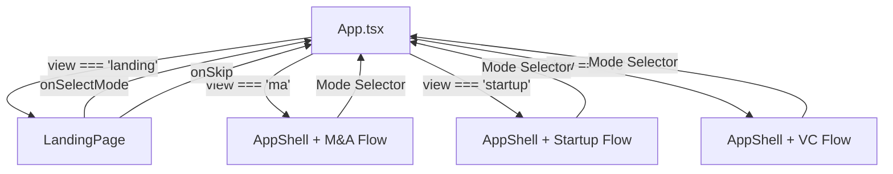
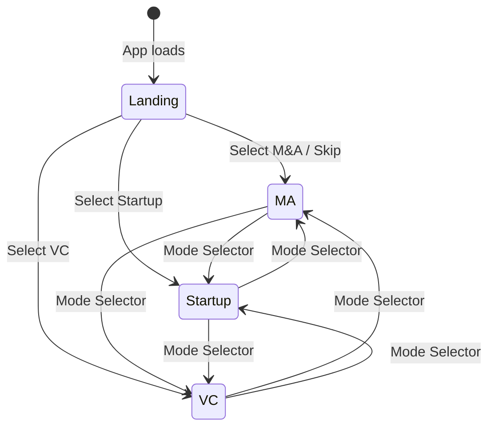

# Design Document: Landing Page

## Overview

This feature introduces a landing page as the default entry point for Dealflow Engine. Currently, the app drops users straight into the M&A step flow. The landing page will explain the platform's purpose, present three mode-selection cards (M&A, Startup, VC), and offer a skip shortcut for returning users. A persistent BSL 1.1 license line is added to the existing AppShell footer and mirrored on the landing page.

The change is entirely frontend (React 18 + TypeScript + TailwindCSS). No backend, API, or data model changes are required.

### Key Design Decisions

1. **New `AppView` state** — A new state value `'landing'` is added alongside the existing `AppMode` values. `App.tsx` renders `LandingPage` when the view is `'landing'` and the existing mode shells otherwise. This avoids a router dependency and keeps the single-component architecture.
2. **LandingPage is a standalone component** — It does not use `AppShell` because it has no step indicator, no mode selector header, and a different layout. It renders its own minimal header and footer.
3. **Footer license text added inline** — The existing `AppShell` footer already renders; we add the "BSL 1.1" text there rather than creating a separate `Footer` component, keeping the change minimal.
4. **No localStorage for landing page bypass** — The landing page always shows on load. The "skip" button simply navigates to the default mode (`'ma'`), matching previous behavior. This keeps state management simple and avoids stale preferences.

## Architecture



### State Flow



The mode selector in AppShell transitions between analysis modes without returning to the landing page. Only the initial load and an explicit "back to landing" action (if added later) would show the landing page.

## Components and Interfaces

### Modified: `App.tsx`

Current state type `AppMode = 'ma' | 'startup' | 'vc'` is extended to include `'landing'`:

```typescript
type AppView = 'landing' | 'ma' | 'startup' | 'vc'
```

- `useState<AppView>('landing')` replaces `useState<AppMode>('ma')` as the initial state.
- When `appView === 'landing'`, render `<LandingPage>`.
- When `appView` is `'ma' | 'startup' | 'vc'`, render the existing mode flows unchanged.
- `onAppModeChange` passed to `AppShell` is wired to `setAppView`, so the mode selector still works. Since `AppShell` only renders mode buttons for `'ma' | 'startup' | 'vc'`, the landing page is never reachable from the mode selector — which is the desired behavior.

```typescript
// Simplified view logic
export default function App() {
  const [appView, setAppView] = useState<AppView>('landing')

  if (appView === 'landing') {
    return (
      <LandingPage
        onSelectMode={(mode: AppMode) => setAppView(mode)}
        onSkip={() => setAppView('ma')}
      />
    )
  }

  // ... existing mode rendering with appMode = appView as AppMode
}
```

### New: `LandingPage.tsx`

Location: `frontend/src/components/layout/LandingPage.tsx`

```typescript
interface LandingPageProps {
  onSelectMode: (mode: 'ma' | 'startup' | 'vc') => void
  onSkip: () => void
}
```

Structure:
- Minimal header with "Dealflow Engine" branding (no mode selector)
- Hero section: app name, tagline, brief description
- Three mode cards in a responsive grid, each with:
  - Mode-specific accent color (blue/purple/emerald border or gradient)
  - Mode title and short description
  - Click handler calling `onSelectMode('ma' | 'startup' | 'vc')`
- Skip link/button below the cards, visually subordinate (smaller, muted text, no fill)
- Footer with "Dealflow Engine" branding and "BSL 1.1" license text

Styling: dark-mode only (`bg-slate-900`, `text-slate-100`), consistent with AppShell.

### Modified: `AppShell.tsx` Footer

The existing footer is updated to include the BSL 1.1 license text:

```typescript
{/* Footer — existing */}
<footer className="border-t border-slate-800 mt-20 py-6">
  <div className="...">
    <div>
      <span>Dealflow Engine</span>
      <span>Institutional-grade deal intelligence</span>
    </div>
    <div>
      <a href="...">GitHub</a>
      <span>&middot;</span>
      <span>BSL 1.1</span>  {/* Changed from "Open Source" */}
    </div>
  </div>
</footer>
```

The "Open Source" text is replaced with "BSL 1.1" to accurately reflect the license.

## Data Models

No new data models are introduced. The feature is purely presentational.

The only type change is the extension of the view state:

```typescript
// Existing
type AppMode = 'ma' | 'startup' | 'vc'

// New (in App.tsx)
type AppView = 'landing' | 'ma' | 'startup' | 'vc'
type AppMode = 'ma' | 'startup' | 'vc'  // unchanged, still used by AppShell
```

`AppMode` remains unchanged for `AppShell` props. `AppView` is internal to `App.tsx`.


## Correctness Properties

*A property is a characteristic or behavior that should hold true across all valid executions of a system — essentially, a formal statement about what the system should do. Properties serve as the bridge between human-readable specifications and machine-verifiable correctness guarantees.*

### Property 1: Mode selection navigates to the correct analysis flow

*For any* mode in `{'ma', 'startup', 'vc'}`, when the user clicks the corresponding mode card on the LandingPage, the app view should transition to that mode and the LandingPage should no longer be rendered.

**Validates: Requirements 2.2, 2.3, 2.4**

### Property 2: Mode selector is present in all analysis flows

*For any* analysis mode in `{'ma', 'startup', 'vc'}`, when the AppShell is rendered, the header should contain mode selector buttons for all three modes.

**Validates: Requirements 4.1**

### Property 3: Mode switching never returns to landing page

*For any* pair of analysis modes `(source, target)` where `source ≠ target`, when the user switches from `source` to `target` via the AppShell mode selector, the resulting view should be `target` (never `'landing'`).

**Validates: Requirements 4.2**

### Property 4: BSL 1.1 license text is visible in footer across all views

*For any* view in `{'landing', 'ma', 'startup', 'vc'}`, the rendered footer should contain the text "BSL 1.1".

**Validates: Requirements 5.1, 5.2**

## Error Handling

This feature is purely presentational with no API calls, async operations, or user data input. Error scenarios are minimal:

| Scenario | Handling |
|---|---|
| `onSelectMode` called with invalid value | TypeScript type system prevents this at compile time — `mode` parameter is typed as `'ma' \| 'startup' \| 'vc'` |
| LandingPage rendered when `appView` is not `'landing'` | Not possible — conditional rendering in `App.tsx` only renders LandingPage when `appView === 'landing'` |
| AppShell `onAppModeChange` receives `'landing'` | The mode selector buttons only emit `'ma'`, `'startup'`, or `'vc'` — `'landing'` is never an option. The `AppView` type allows it at the type level, but no UI path produces it. |

No try/catch blocks, error boundaries, or fallback UI are needed for this feature. The existing error handling in each analysis flow remains unchanged.

## Testing Strategy

### Testing Framework

- **Unit/Component tests**: Vitest + React Testing Library (already configured in the project)
- **Property-based tests**: `fast-check` (to be added as a dev dependency) — the standard PBT library for TypeScript/Vitest

### Unit Tests

Unit tests cover specific examples, edge cases, and structural checks:

1. **LandingPage renders app name and description** — Verify "Dealflow Engine" text and platform description are present (Req 1.2)
2. **LandingPage renders three mode cards** — Verify exactly 3 call-to-action elements exist (Req 2.1)
3. **LandingPage renders skip button** — Verify the skip control exists and is a button/link (Req 3.1)
4. **Skip button navigates to M&A** — Click skip, verify `onSkip` callback is invoked (Req 3.2)
5. **App initial state is landing** — Render App, verify LandingPage is shown (Req 1.1)
6. **LandingPage footer contains BSL 1.1** — Verify footer text (Req 5.2)

### Property-Based Tests

Each correctness property is implemented as a single property-based test using `fast-check`. Each test runs a minimum of 100 iterations and is tagged with a comment referencing the design property.

1. **Feature: landing-page, Property 1: Mode selection navigates to the correct analysis flow**
   - Generator: `fc.constantFrom('ma', 'startup', 'vc')`
   - Action: Render LandingPage, click the card for the generated mode
   - Assert: `onSelectMode` was called with the generated mode

2. **Feature: landing-page, Property 2: Mode selector is present in all analysis flows**
   - Generator: `fc.constantFrom('ma', 'startup', 'vc')`
   - Action: Render AppShell with the generated `appMode`
   - Assert: All three mode selector buttons (M&A, Startup, VC) are present in the DOM

3. **Feature: landing-page, Property 3: Mode switching never returns to landing page**
   - Generator: `fc.tuple(fc.constantFrom('ma', 'startup', 'vc'), fc.constantFrom('ma', 'startup', 'vc')).filter(([a, b]) => a !== b)`
   - Action: Render AppShell with source mode, click the target mode button
   - Assert: `onAppModeChange` was called with the target mode (not `'landing'`)

4. **Feature: landing-page, Property 4: BSL 1.1 license text is visible in footer across all views**
   - Generator: `fc.constantFrom('landing', 'ma', 'startup', 'vc')`
   - Action: Render the appropriate component (LandingPage for `'landing'`, AppShell for others)
   - Assert: Footer contains "BSL 1.1"

### Test Configuration

```typescript
// vitest.config.ts — no changes needed, existing config supports this
// fast-check default: 100 iterations per property
fc.assert(fc.property(/* ... */), { numRuns: 100 })
```

### Dependencies to Add

```bash
npm install -D fast-check
```
