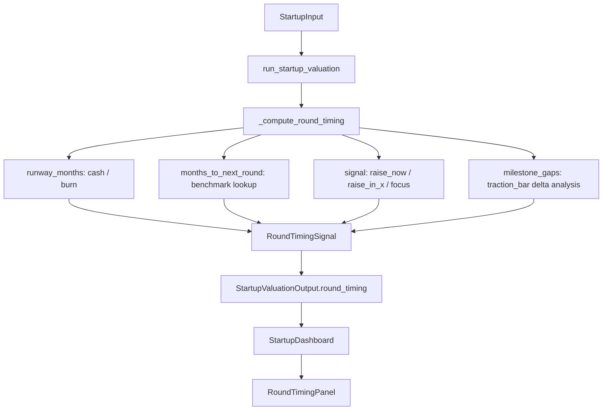
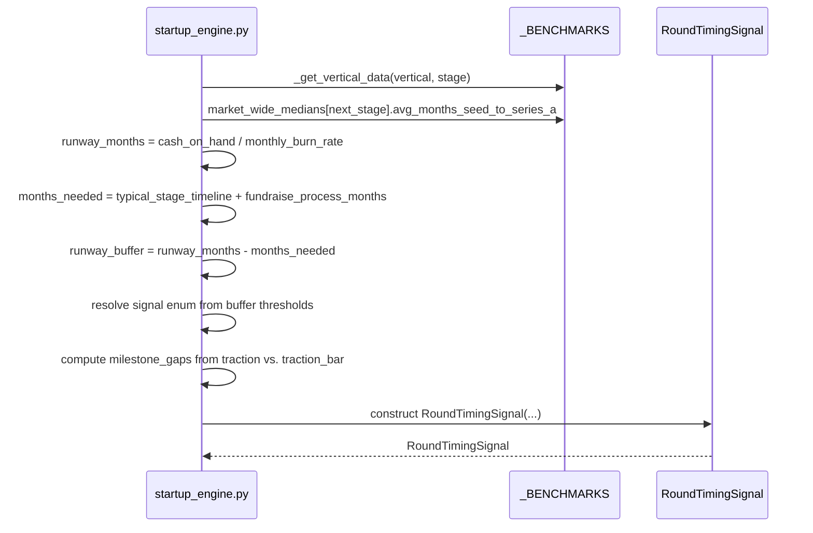

# Design Document: Round Timing Signal

## Overview

The Round Timing Signal adds a `RoundTimingSignal` output section to `StartupValuationOutput` that tells founders exactly where they stand in the fundraising cycle: how many months of runway they have, whether that runway is sufficient to reach the next round's typical traction bar, a clear action signal (`raise_now` / `raise_in_x_months` / `focus_on_milestones`), and the specific milestones the engine expects them to hit before the next round based on vertical + stage benchmarks already in the system.

The computation is purely deterministic — it reads from already-computed traction fields and existing benchmark data. No new user inputs are required. The engine never raises exceptions; all edge cases (zero burn, no ARR, Series A as current stage) return a valid output with appropriate flags.

## Architecture



## Sequence Diagram — Signal Computation



## Components and Interfaces

### Backend: `RoundTimingSignal` (new Pydantic model in `startup_models.py`)

**Purpose**: Carries all computed timing data from engine to API response and frontend.

**Interface**:
```python
class RaiseSignal(str, Enum):
    RAISE_NOW        = "raise_now"         # runway < raise_threshold
    RAISE_IN_MONTHS  = "raise_in_months"   # buffer exists but window is approaching
    FOCUS_MILESTONES = "focus_milestones"  # ample runway; milestone gaps remain

class RoundTimingSignal(BaseModel):
    runway_months: float                   # cash_on_hand / monthly_burn_rate; 0 if no burn
    months_to_next_round: int              # typical stage-to-stage timeline from benchmarks
    fundraise_process_months: int          # standard time to close a round (default 3)
    months_until_raise_window: float       # runway_months - months_to_next_round - fundraise_process_months
    signal: RaiseSignal
    signal_label: str                      # human-readable one-liner
    signal_detail: str                     # 2-3 sentence explanation
    milestone_gaps: list[str]              # what the engine expects before next round
    milestone_met_count: int               # how many milestone criteria are already met
    milestone_total_count: int             # total milestone criteria checked
    raise_in_months: float | None          # populated only when signal == RAISE_IN_MONTHS
    warnings: list[str]                    # e.g. "no burn rate provided"
```

**Responsibilities**:
- Carry all timing data as a self-contained block
- `warnings` list absorbs all edge cases (zero burn, no ARR, Series A terminal stage) so the engine never raises

### Backend: `_compute_round_timing()` (new private function in `startup_engine.py`)

**Purpose**: Pure computation function; called at the end of `run_startup_valuation` before the return statement.

**Interface**:
```python
def _compute_round_timing(inp: StartupInput, vdata: dict) -> RoundTimingSignal:
    ...
```

**Responsibilities**:
- Compute `runway_months` from `traction.cash_on_hand / traction.monthly_burn_rate`
- Look up `months_to_next_round` from `market_wide_medians` (only `avg_months_seed_to_series_a` = 24 exists; pre-seed-to-seed is estimated at 18 months)
- Derive `months_until_raise_window` and resolve the `RaiseSignal` enum
- Compute `milestone_gaps` by comparing current traction against the next stage's `traction_bar` text and quantitative thresholds from `vdata`
- Return a fully populated `RoundTimingSignal` with no exceptions

### Frontend: `RoundTimingPanel` (new component in `frontend/src/components/output/startup/`)

**Purpose**: Renders the timing signal as a visually distinct card in the startup dashboard.

**Interface**:
```typescript
interface RoundTimingPanelProps {
  timing: RoundTimingSignal
  stage: StartupStage
}
function RoundTimingPanel({ timing, stage }: RoundTimingPanelProps): JSX.Element
```

**Responsibilities**:
- Display the signal badge (`raise_now` = red, `raise_in_months` = amber, `focus_milestones` = green)
- Show runway bar (months remaining vs. months needed)
- List milestone gaps with check/cross icons
- Render warnings inline if present

## Data Models

### `RoundTimingSignal` (Python / TypeScript mirror)

```typescript
export type RaiseSignal = 'raise_now' | 'raise_in_months' | 'focus_milestones'

export interface RoundTimingSignal {
  runway_months: number           // 0.0 when no burn data
  months_to_next_round: number    // benchmark-derived integer
  fundraise_process_months: number
  months_until_raise_window: number
  signal: RaiseSignal
  signal_label: string
  signal_detail: string
  milestone_gaps: string[]
  milestone_met_count: number
  milestone_total_count: number
  raise_in_months: number | null
  warnings: string[]
}
```

**Validation rules**:
- `runway_months >= 0` always (floor at 0 when no burn)
- `months_to_next_round` is a positive integer from benchmark lookup or hardcoded fallback
- `milestone_gaps` is an empty list (not null) when all milestones are met
- `warnings` is an empty list (not null) when no edge cases apply

### `StartupValuationOutput` extension

```python
# New field added to existing model
round_timing: RoundTimingSignal
```

```typescript
// New field added to existing interface
round_timing: RoundTimingSignal
```

## Key Functions with Formal Specifications

### `_compute_round_timing(inp, vdata)`

**Preconditions**:
- `inp` is a valid `StartupInput` (guaranteed by Pydantic)
- `vdata` is the benchmark dict for `inp.fundraise.vertical × inp.fundraise.stage`
- `_BENCHMARKS` is loaded at module level

**Postconditions**:
- Returns a `RoundTimingSignal` — never raises
- `runway_months == 0.0` when `monthly_burn_rate == 0`
- `signal == RAISE_NOW` when `runway_months < (fundraise_process_months + 3)`
- `signal == FOCUS_MILESTONES` when `months_until_raise_window > 6`
- `signal == RAISE_IN_MONTHS` otherwise
- `raise_in_months` is `None` unless `signal == RAISE_IN_MONTHS`
- `milestone_gaps` contains only strings (never None entries)
- `warnings` is non-empty when `monthly_burn_rate == 0` or `stage == series_a`

**Loop invariants** (milestone gap loop):
- Each iteration appends at most one string to `milestone_gaps`
- `milestone_met_count + len(milestone_gaps) == milestone_total_count` at loop exit

### Signal threshold logic

```
RAISE_NOW        when runway_months < (fundraise_process_months + 3)
                 i.e. less than ~6 months total — already in danger zone

RAISE_IN_MONTHS  when 0 <= months_until_raise_window <= 6
                 i.e. window is approaching; start process now

FOCUS_MILESTONES when months_until_raise_window > 6
                 i.e. ample runway; milestone progress is the priority
```

### Milestone gap computation

The engine checks quantitative thresholds from the **next stage's** benchmark block (not the current stage). For each criterion:

```
next_vdata = _get_vertical_data(vertical, next_stage)

Checks performed (where data exists in next_vdata):
  1. ARR vs. arr_required_min          → "Reach $Xm ARR (currently $Ym)"
  2. ARR vs. arr_required_typical      → "Reach $Xm ARR (typical for stage)"
  3. MoM growth vs. yoy_growth_expected → "Sustain X% YoY growth"
  4. traction_bar text                 → always appended as qualitative context
```

For pre-revenue verticals (biotech, deep tech) where `arr_required_min` is null, the engine falls back to the `traction_bar` string from the next stage as the sole milestone descriptor.

## Algorithmic Pseudocode

### Main algorithm

```pascal
PROCEDURE _compute_round_timing(inp, vdata)
  INPUT: inp: StartupInput, vdata: dict (current stage benchmark)
  OUTPUT: RoundTimingSignal

  warnings ← []
  stage ← inp.fundraise.stage
  vertical ← inp.fundraise.vertical

  // --- Runway ---
  IF inp.traction.monthly_burn_rate > 0 THEN
    runway_months ← inp.traction.cash_on_hand / inp.traction.monthly_burn_rate
  ELSE
    runway_months ← 0.0
    warnings.append("No burn rate provided — runway cannot be computed")
  END IF

  // --- Stage timeline lookup ---
  IF stage == SERIES_A THEN
    months_to_next_round ← 0
    warnings.append("Series A is the terminal stage in this engine — no next-round timeline")
    RETURN RoundTimingSignal(signal=FOCUS_MILESTONES, runway_months=runway_months, ...)
  ELSE IF stage == SEED THEN
    months_to_next_round ← _BENCHMARKS["market_wide_medians"]["series_a"]["avg_months_seed_to_series_a"]
    // = 24 from benchmark data
  ELSE  // PRE_SEED
    months_to_next_round ← 18  // hardcoded estimate; no benchmark field exists for pre-seed→seed
  END IF

  fundraise_process_months ← 3  // standard time to close a round
  months_until_raise_window ← runway_months - months_to_next_round - fundraise_process_months

  // --- Signal resolution ---
  IF runway_months < (fundraise_process_months + 3) THEN
    signal ← RAISE_NOW
    raise_in_months ← null
  ELSE IF months_until_raise_window <= 6 THEN
    signal ← RAISE_IN_MONTHS
    raise_in_months ← max(0, months_until_raise_window)
  ELSE
    signal ← FOCUS_MILESTONES
    raise_in_months ← null
  END IF

  // --- Milestone gaps ---
  next_stage ← next_stage_for(stage)  // pre_seed→seed, seed→series_a
  next_vdata ← _get_vertical_data(vertical, next_stage)
  milestone_gaps ← []
  milestone_met_count ← 0
  milestone_total_count ← 0
  arr ← inp.traction.annual_recurring_revenue

  // Check 1: ARR minimum
  arr_min ← next_vdata.get("arr_required_min")
  IF arr_min IS NOT NULL THEN
    milestone_total_count += 1
    IF arr >= arr_min THEN
      milestone_met_count += 1
    ELSE
      milestone_gaps.append(f"Reach ${arr_min}M ARR minimum (currently ${arr:.2f}M)")
    END IF
  END IF

  // Check 2: ARR typical
  arr_typical ← next_vdata.get("arr_required_typical")
  IF arr_typical IS NOT NULL THEN
    milestone_total_count += 1
    IF arr >= arr_typical THEN
      milestone_met_count += 1
    ELSE
      milestone_gaps.append(f"Reach ${arr_typical}M ARR (typical for {next_stage}) (currently ${arr:.2f}M)")
    END IF
  END IF

  // Check 3: YoY growth
  yoy_growth_expected ← next_vdata.get("yoy_growth_expected")
  IF yoy_growth_expected IS NOT NULL THEN
    milestone_total_count += 1
    yoy_approx ← inp.traction.mom_growth_rate * 12
    IF yoy_approx >= yoy_growth_expected THEN
      milestone_met_count += 1
    ELSE
      milestone_gaps.append(f"Sustain {yoy_growth_expected:.0f}x YoY growth (currently ~{yoy_approx:.1f}x)")
    END IF
  END IF

  // Check 4: Qualitative traction bar (always added as context)
  traction_bar_next ← next_vdata.get("traction_bar", "")
  IF traction_bar_next != "" THEN
    milestone_total_count += 1
    // Qualitative — always listed as a gap item for founder awareness
    milestone_gaps.append(f"Traction bar for {next_stage}: {traction_bar_next}")
  END IF

  // --- Labels ---
  signal_label ← resolve_signal_label(signal, raise_in_months, runway_months)
  signal_detail ← resolve_signal_detail(signal, runway_months, months_to_next_round, milestone_met_count, milestone_total_count)

  RETURN RoundTimingSignal(
    runway_months=round(runway_months, 1),
    months_to_next_round=months_to_next_round,
    fundraise_process_months=fundraise_process_months,
    months_until_raise_window=round(months_until_raise_window, 1),
    signal=signal,
    signal_label=signal_label,
    signal_detail=signal_detail,
    milestone_gaps=milestone_gaps,
    milestone_met_count=milestone_met_count,
    milestone_total_count=milestone_total_count,
    raise_in_months=raise_in_months,
    warnings=warnings,
  )
END PROCEDURE
```

## Example Usage

**Scenario A — Seed stage, 14 months runway, strong ARR**
```
Input:  stage=seed, cash_on_hand=0.7, monthly_burn=0.05, ARR=1.8M, mom_growth=0.12
        vertical=b2b_saas

Computed:
  runway_months          = 0.7 / 0.05 = 14.0
  months_to_next_round   = 24  (avg_months_seed_to_series_a)
  fundraise_process      = 3
  months_until_window    = 14 - 24 - 3 = -13  → RAISE_NOW

Output:
  signal       = "raise_now"
  signal_label = "Raise now — runway is critically short"
  milestone_gaps = [
    "Reach $1.0M ARR minimum (currently $1.80M)",  ← met, not in gaps
    "Reach $2.5M ARR (typical for series_a) (currently $1.80M)",
    "Sustain 2.5x YoY growth (currently ~1.4x)",
    "Traction bar for series_a: $20K–$150K MRR ($240K–$1.8M ARR); 80%+ gross margin; NRR > 100%"
  ]
```

**Scenario B — Pre-seed, 24 months runway, no revenue**
```
Input:  stage=pre_seed, cash_on_hand=0.3, monthly_burn=0.0125, ARR=0, mom_growth=0
        vertical=ai_ml_infrastructure

Computed:
  runway_months          = 0.3 / 0.0125 = 24.0
  months_to_next_round   = 18  (pre_seed→seed estimate)
  fundraise_process      = 3
  months_until_window    = 24 - 18 - 3 = 3  → RAISE_IN_MONTHS (3 <= 6)

Output:
  signal          = "raise_in_months"
  raise_in_months = 3.0
  signal_label    = "Start your raise in ~3 months"
  milestone_gaps  = [
    "Reach $0.5M ARR minimum (currently $0.00M)",
    "Traction bar for seed: $500K–$2M ARR or strong named pilots with large enterprises"
  ]
```

**Scenario C — Seed, 30 months runway, milestones ahead**
```
Input:  stage=seed, cash_on_hand=1.5, monthly_burn=0.05, ARR=0.8M, mom_growth=0.18
        vertical=developer_tools

Computed:
  runway_months          = 30.0
  months_until_window    = 30 - 24 - 3 = 3  → RAISE_IN_MONTHS

Output:
  signal          = "raise_in_months"
  raise_in_months = 3.0
  milestone_gaps  = [
    "Reach $1.0M ARR minimum (currently $0.80M)",
    "Reach $3.0M ARR (typical for series_a) (currently $0.80M)",
    "Sustain 3.0x YoY growth (currently ~2.2x)",
    "Traction bar for series_a: ..."
  ]
```

## Correctness Properties

- For all inputs where `monthly_burn_rate == 0`: `runway_months == 0.0` AND `warnings` is non-empty
- For all inputs where `stage == series_a`: `signal == focus_milestones` AND `months_to_next_round == 0` AND `warnings` is non-empty
- For all inputs: `milestone_met_count + len(milestone_gaps_quantitative) <= milestone_total_count`
- For all inputs: `signal == raise_now` implies `runway_months < fundraise_process_months + 3`
- For all inputs: `signal == focus_milestones` implies `months_until_raise_window > 6` OR `stage == series_a`
- For all inputs: `raise_in_months is None` when `signal != raise_in_months`
- For all inputs: `round_timing` field is always present on `StartupValuationOutput` (never null)
- For all inputs: `milestone_gaps` is a list (never null), may be empty

## Error Handling

### Zero burn rate
**Condition**: `traction.monthly_burn_rate == 0`
**Response**: `runway_months = 0.0`, `signal = raise_now` (conservative), warning added: `"No burn rate provided — runway cannot be computed. Signal defaults to raise_now."`
**Recovery**: User provides burn rate on re-run

### Series A terminal stage
**Condition**: `fundraise.stage == series_a`
**Response**: `months_to_next_round = 0`, `signal = focus_milestones`, warning: `"Series A is the terminal stage in this engine — no next-round timeline available."`
**Recovery**: N/A — informational only

### Missing next-stage benchmark data
**Condition**: `next_vdata` is empty or missing quantitative fields
**Response**: Quantitative milestone checks are skipped; `traction_bar` text is used as sole milestone descriptor; no exception raised
**Recovery**: Benchmark data update

### Negative `months_until_raise_window`
**Condition**: Runway is shorter than `months_to_next_round + fundraise_process_months`
**Response**: `months_until_raise_window` is stored as-is (can be negative); signal resolves to `raise_now`; no clamping to avoid hiding the severity
**Recovery**: Founder raises immediately

## Testing Strategy

### Unit Testing

Key test cases for `_compute_round_timing`:
- Zero burn rate → `runway_months == 0`, `signal == raise_now`, warning present
- Series A stage → `signal == focus_milestones`, `months_to_next_round == 0`, warning present
- Seed + 14 months runway → `signal == raise_now` (14 < 24 + 3)
- Seed + 30 months runway → `signal == raise_in_months`, `raise_in_months == 3.0`
- Seed + 40 months runway → `signal == focus_milestones`
- Pre-seed + 24 months runway → `signal == raise_in_months`
- Biotech (null ARR fields) → no quantitative gaps, traction_bar text present, no exception
- All 13 verticals × 3 stages → no exceptions raised

### Property-Based Testing

**Property test library**: `hypothesis`

Properties to verify:
- For any valid `StartupInput`: `_compute_round_timing` never raises
- For any input with `monthly_burn_rate > 0`: `runway_months == cash_on_hand / monthly_burn_rate` (within float tolerance)
- For any input: `signal` is always one of the three enum values
- For any input: `milestone_gaps` is always a list of strings

### Integration Testing

- `run_startup_valuation` returns output with `round_timing` field populated for all 13 verticals × 3 stages
- `round_timing` field serializes correctly through FastAPI JSON response
- Frontend `RoundTimingSignal` TypeScript type matches backend Pydantic model field-for-field

## Performance Considerations

The computation is O(1) — a fixed number of dict lookups and arithmetic operations. No loops over variable-length data except the milestone gap checks (fixed at 4 checks maximum). No additional I/O or benchmark file reads beyond what `run_startup_valuation` already performs.

## Security Considerations

All inputs are validated by Pydantic before reaching `_compute_round_timing`. The function only reads from already-validated fields and the pre-loaded `_BENCHMARKS` dict. No user-controlled strings are interpolated into anything other than display labels.

## Dependencies

No new dependencies. Uses:
- Existing `_BENCHMARKS` module-level dict (already loaded)
- Existing `_get_vertical_data()` helper
- Existing `StartupInput`, `StartupValuationOutput` models
- Existing `StartupStage`, `StartupVertical` enums
- Frontend: existing `purple-*` Tailwind classes, `lucide-react` icons already in use
