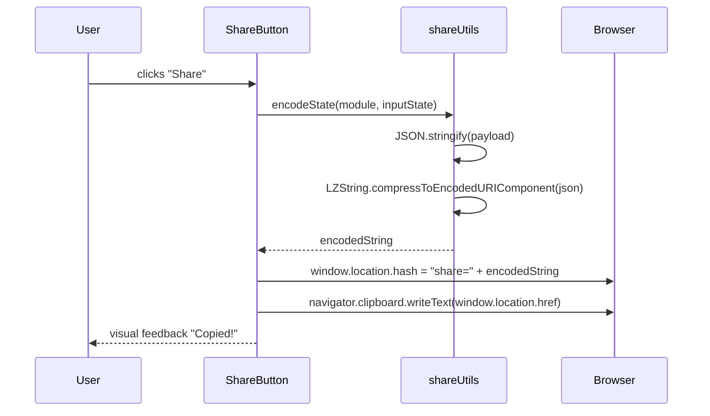
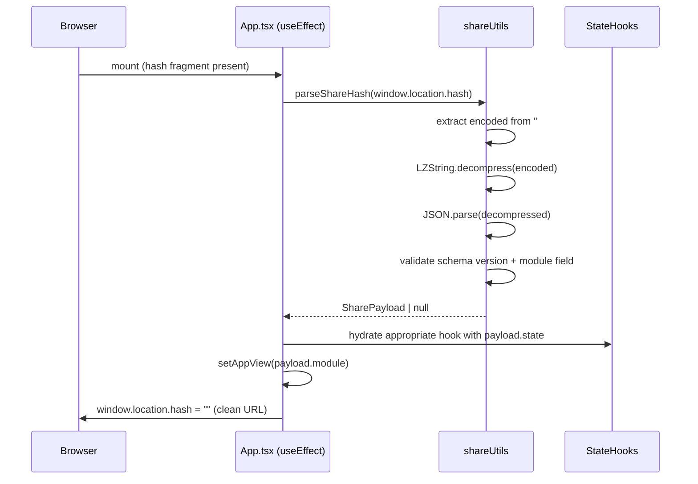

# Design Document: Shareable Output Links

## Overview

Allow users to generate a shareable URL that encodes the current deal/valuation input state so co-founders, advisors, or investors can open the link and see the same inputs pre-populated, then re-run the engine themselves. The entire state is encoded in the URL hash fragment — no backend storage, no user accounts, no new API endpoints.

The feature works across all three modules (M&A, Startup Valuation, VC Fund-Seat). Compression via `lz-string` keeps URLs short enough to be copy-pasteable. The recipient always re-runs the computation; output is never encoded or transmitted.

## Architecture

```mermaid
graph TD
    subgraph "Share Flow (Sender)"
        A[Results Dashboard / Output Screen] --> B[ShareButton component]
        B --> C[encodeState - shareUtils.ts]
        C --> D[JSON.stringify input state]
        D --> E[LZString.compressToEncodedURIComponent]
        E --> F[window.location.hash = share=encoded]
        F --> G[Copy URL to clipboard]
    end

    subgraph "Hydration Flow (Recipient)"
        H[App loads with hash fragment] --> I[parseShareHash - shareUtils.ts]
        I --> J{hash valid?}
        J -- yes --> K[decodeState]
        K --> L[LZString.decompressFromEncodedURIComponent]
        L --> M[JSON.parse]
        M --> N{module field}
        N -- ma --> O[hydrateMAState]
        N -- startup --> P[hydrateStartupState]
        N -- vc --> Q[hydrateVCState]
        O & P & Q --> R[setAppView to correct module]
        R --> S[User sees pre-populated inputs]
        J -- no / malformed --> T[Ignore hash, load normally]
    end
```



## Sequence Diagrams

### Share URL Generation



### URL Hydration on Load



## Components and Interfaces

### Component: ShareButton

**Purpose**: Renders a "Share" button on each module's results/output screen. On click, encodes current input state into the URL hash and copies the full URL to clipboard. Shows transient "Copied!" feedback.

**Location**: `frontend/src/components/shared/ShareButton.tsx`

**Interface**:
```typescript
interface ShareButtonProps {
  module: ShareModule           // 'ma' | 'startup' | 'vc'
  inputState: MAInputState | StartupInputState | VCInputState
  colorScheme: 'blue' | 'purple' | 'emerald'  // matches module color
  className?: string
}
```

**Responsibilities**:
- Call `encodeState()` from `shareUtils.ts`
- Set `window.location.hash`
- Write URL to clipboard via `navigator.clipboard.writeText`
- Show 2-second "Copied!" feedback state, then revert to "Share"
- Handle clipboard API unavailability gracefully (show URL in a prompt fallback)

### Module: shareUtils.ts

**Purpose**: Pure utility functions for encoding and decoding share payloads. No React dependencies — fully testable in isolation.

**Location**: `frontend/src/lib/shareUtils.ts`

**Interface**:
```typescript
export type ShareModule = 'ma' | 'startup' | 'vc'

// The envelope wrapping any module's input state
export interface SharePayload {
  v: number           // schema version (currently 1)
  module: ShareModule
  state: MAInputState | StartupInputState | VCInputState
}

// Slices of state that get encoded — inputs only, never output
export interface MAInputState {
  mode: ModelMode
  acquirer: Partial<AcquirerProfile>
  target: Partial<TargetProfile>
  structure: Partial<DealStructure>
  ppa: Partial<PurchasePriceAllocation>
  synergies: SynergyAssumptions
}

export interface StartupInputState {
  company_name: string
  team: Partial<TeamProfile>
  traction: Partial<TractionMetrics>
  product: Partial<ProductProfile>
  market: Partial<MarketProfile>
  fundraise: Partial<FundraisingProfile>
  is_ai_native: boolean
  ai_native_score: number
  ai_answers: [boolean, boolean, boolean, boolean]
}

export interface VCInputState {
  fund: FundProfile
  deal: Partial<VCDealInput>
}

export function encodeState(module: ShareModule, state: MAInputState | StartupInputState | VCInputState): string
export function decodeState(encoded: string): SharePayload | null
export function parseShareHash(hash: string): string | null  // extracts encoded string from "#share=..."
```

### App.tsx changes

**Purpose**: On mount, detect `#share=` in the URL hash, decode the payload, hydrate the appropriate state hook, and navigate to the correct module view.

**New hook**: A `useEffect` with `[]` dependency runs once on mount before any other rendering logic.

## Data Models

### SharePayload (envelope)

```typescript
interface SharePayload {
  v: number           // schema version — bump when input shapes change incompatibly
  module: 'ma' | 'startup' | 'vc'
  state: MAInputState | StartupInputState | VCInputState
}
```

**Validation rules**:
- `v` must be a positive integer; if missing or mismatched, treat as malformed
- `module` must be one of the three known values
- `state` must be a non-null object; individual field validation is lenient (partial state is acceptable — missing fields fall back to hook defaults)

### URL Format

```
https://app.example.com/#share=<lz-string-encoded-base64>
```

- Hash fragment (`#`) avoids server-side routing issues and is never sent to the server
- The encoded string is URL-safe (lz-string's `compressToEncodedURIComponent` handles this)
- Typical compressed sizes: M&A ~400–700 chars, Startup ~200–350 chars, VC ~250–400 chars

## Algorithmic Pseudocode

### encodeState

```pascal
PROCEDURE encodeState(module, inputState)
  INPUT: module: ShareModule, inputState: object
  OUTPUT: encodedString: string

  PRECONDITIONS:
    - module IN {'ma', 'startup', 'vc'}
    - inputState is a non-null object

  POSTCONDITIONS:
    - Returns a URL-safe string
    - decodeState(result).state deep-equals inputState (round-trip fidelity)

  BEGIN
    payload ← { v: SCHEMA_VERSION, module: module, state: inputState }
    json ← JSON.stringify(payload)
    encoded ← LZString.compressToEncodedURIComponent(json)
    RETURN encoded
  END
END PROCEDURE
```

### decodeState

```pascal
PROCEDURE decodeState(encoded)
  INPUT: encoded: string
  OUTPUT: SharePayload | null

  PRECONDITIONS:
    - encoded is a non-empty string

  POSTCONDITIONS:
    - Returns null on ANY error (never throws)
    - If non-null, result.module is a valid ShareModule
    - If non-null, result.v is a positive integer

  BEGIN
    TRY
      json ← LZString.decompressFromEncodedURIComponent(encoded)
      IF json IS null OR json IS empty THEN
        RETURN null
      END IF

      payload ← JSON.parse(json)

      IF payload.v IS NOT a positive integer THEN
        RETURN null
      END IF

      IF payload.module NOT IN {'ma', 'startup', 'vc'} THEN
        RETURN null
      END IF

      IF payload.state IS null OR NOT object THEN
        RETURN null
      END IF

      RETURN payload AS SharePayload
    CATCH any error
      RETURN null
    END TRY
  END
END PROCEDURE
```

### parseShareHash

```pascal
PROCEDURE parseShareHash(hash)
  INPUT: hash: string  (e.g. "#share=abc123")
  OUTPUT: encodedString: string | null

  BEGIN
    IF hash does NOT start with "#share=" THEN
      RETURN null
    END IF

    encoded ← hash.substring(7)  // strip "#share="

    IF encoded IS empty THEN
      RETURN null
    END IF

    RETURN encoded
  END
END PROCEDURE
```

### App.tsx hydration (useEffect on mount)

```pascal
PROCEDURE hydrateFromHash()
  INPUT: window.location.hash (side-effect read)
  OUTPUT: side-effects on state hooks and appView

  PRECONDITIONS:
    - Runs once on component mount
    - All three state hooks are initialized

  POSTCONDITIONS:
    - If hash is valid: appView is set to payload.module, appropriate hook is hydrated
    - If hash is invalid/absent: no state changes, app loads normally
    - Hash is cleared from URL after successful hydration (clean URL)

  BEGIN
    encoded ← parseShareHash(window.location.hash)

    IF encoded IS null THEN
      RETURN  // no share hash, normal load
    END IF

    payload ← decodeState(encoded)

    IF payload IS null THEN
      RETURN  // malformed, ignore silently
    END IF

    MATCH payload.module
      CASE 'ma':
        hydrateMAState(payload.state AS MAInputState)
        setAppView('ma')
      CASE 'startup':
        hydrateStartupState(payload.state AS StartupInputState)
        setAppView('startup')
      CASE 'vc':
        hydrateVCState(payload.state AS VCInputState)
        setAppView('vc')
    END MATCH

    window.location.hash = ""  // clean URL after hydration
  END
END PROCEDURE
```

## Key Functions with Formal Specifications

### encodeState()

**Preconditions**:
- `module` is one of `'ma' | 'startup' | 'vc'`
- `inputState` is a non-null object (partial fields are fine)

**Postconditions**:
- Returns a non-empty URL-safe string
- `decodeState(encodeState(m, s)).state` deep-equals `s` for any valid `s` (round-trip property)
- Never throws — any serialization error should be caught and re-thrown as a user-visible error message

**Loop Invariants**: N/A (no loops)

### decodeState()

**Preconditions**:
- `encoded` is a string (may be empty or malformed)

**Postconditions**:
- Never throws under any input
- Returns `null` for any malformed, truncated, or version-mismatched input
- Returns a valid `SharePayload` only when all structural checks pass
- Does not mutate any external state

**Loop Invariants**: N/A

### hydrateMAState() / hydrateStartupState() / hydrateVCState()

These are thin wrappers that call the existing hook updater functions with the decoded state. They are defined inside `App.tsx` as local functions within the hydration `useEffect`.

**Preconditions**:
- Payload state is a non-null object (fields may be partial)
- Hook updater functions are available in scope

**Postconditions**:
- Hook state reflects the decoded values merged over defaults
- `step` is reset to `1` (recipient starts at step 1, not mid-flow)
- `output`, `isLoading`, `error` are never set from the payload (always remain at defaults)

## Example Usage

```typescript
// Sender: on the ResultsDashboard for M&A
import { encodeState } from '../lib/shareUtils'

const handleShare = () => {
  const encoded = encodeState('ma', {
    mode: state.mode,
    acquirer: state.acquirer,
    target: state.target,
    structure: state.structure,
    ppa: state.ppa,
    synergies: state.synergies,
  })
  window.location.hash = `share=${encoded}`
  navigator.clipboard.writeText(window.location.href)
}

// Recipient: App.tsx useEffect on mount
useEffect(() => {
  const encoded = parseShareHash(window.location.hash)
  if (!encoded) return
  const payload = decodeState(encoded)
  if (!payload) return

  if (payload.module === 'startup') {
    const s = payload.state as StartupInputState
    setCompanyName(s.company_name)
    updateTeam(s.team)
    updateTraction(s.traction)
    updateProduct(s.product)
    updateMarket(s.market)
    updateFundraise(s.fundraise)
    setAINative(s.is_ai_native)
    setAppView('startup')
  }
  // ... similar for 'ma' and 'vc'
  window.location.hash = ''
}, [])
```

## Correctness Properties

- **Round-trip fidelity**: For any valid input state `s` and module `m`, `decodeState(encodeState(m, s)).state` deep-equals `s`
- **No-throw guarantee**: `decodeState(x)` returns `null` (never throws) for any string `x`, including empty string, random bytes, truncated payloads, and wrong-version payloads
- **Output isolation**: The encoded payload never contains `output`, `isLoading`, `loadingMessage`, or `error` fields
- **Step reset**: After hydration, `step` is always `1` regardless of what was encoded
- **Module isolation**: Hydrating a `'startup'` payload never touches M&A or VC state hooks, and vice versa
- **Idempotent hash clear**: After hydration, `window.location.hash` is cleared so refreshing the page loads normally (no re-hydration loop)

## Error Handling

### Malformed / Truncated URL

**Condition**: `decodeState` receives a string that fails decompression or JSON parsing.
**Response**: Return `null` silently. App loads in default state.
**Recovery**: No user-visible error — the recipient simply sees a blank form.

### Version Mismatch

**Condition**: `payload.v` does not match `SCHEMA_VERSION` (e.g., link was generated by an older build).
**Response**: Return `null`. App loads in default state.
**Recovery**: Optionally show a toast: "This share link was created with an older version and can't be loaded." (non-blocking).

### Oversized State

**Condition**: The compressed+encoded string exceeds a safe URL length (~8000 chars for hash fragments).
**Response**: `encodeState` checks the output length and throws a user-visible error if it exceeds the limit.
**Recovery**: `ShareButton` catches this and shows: "State too large to share. Try simplifying your inputs."
**Note**: With lz-string compression, this is unlikely in practice — M&A state with full synergy arrays compresses to well under 2KB.

### Clipboard API Unavailable

**Condition**: `navigator.clipboard` is undefined (non-HTTPS, old browser).
**Response**: Fall back to `window.prompt("Copy this link:", url)` so the user can manually copy.
**Recovery**: User copies manually from the prompt dialog.

## Testing Strategy

### Unit Testing (shareUtils.ts)

Key test cases for `encodeState` / `decodeState`:
- Round-trip fidelity for each of the three modules with realistic state objects
- `decodeState("")` returns `null`
- `decodeState("not-valid-base64!!!")` returns `null`
- `decodeState` on a payload with `v: 999` returns `null`
- `decodeState` on a payload with unknown `module` returns `null`
- `parseShareHash("#share=abc")` returns `"abc"`
- `parseShareHash("")` returns `null`
- `parseShareHash("#other=abc")` returns `null`

### Property-Based Testing

**Library**: `fast-check`

**Properties to test**:
- For any `MAInputState`, `StartupInputState`, or `VCInputState` object: `decodeState(encodeState(module, state)).state` deep-equals `state`
- For any arbitrary string `s`: `decodeState(s)` never throws
- For any valid `SharePayload`: encoded length is under 8000 characters

### Integration Testing

- `ShareButton` renders with correct color scheme per module
- Clicking `ShareButton` sets `window.location.hash` to a `#share=...` value
- App.tsx hydration `useEffect` correctly populates state hooks from a known encoded payload
- After hydration, `appView` matches `payload.module`
- After hydration, `window.location.hash` is empty

## Performance Considerations

- `lz-string` compression is synchronous and runs in < 1ms for typical state sizes — no async needed
- The hydration `useEffect` runs once on mount with `[]` deps — zero ongoing cost
- `ShareButton` only calls `encodeState` on click, not on every render

## Security Considerations

- The hash fragment is never sent to the server — no server-side exposure of user input data
- `decodeState` uses `JSON.parse` on decompressed data; all fields are treated as untrusted and merged over safe defaults — no `eval` or dynamic code execution
- No PII beyond what the user explicitly entered is encoded (no session tokens, no user IDs)
- The feature works on HTTP (localhost dev) and HTTPS (production) equally

## Dependencies

- `lz-string` npm package — URL-safe compression/decompression (~3KB gzipped). Install: `npm install lz-string` + `npm install --save-dev @types/lz-string`
- No new backend dependencies
- No new backend endpoints
