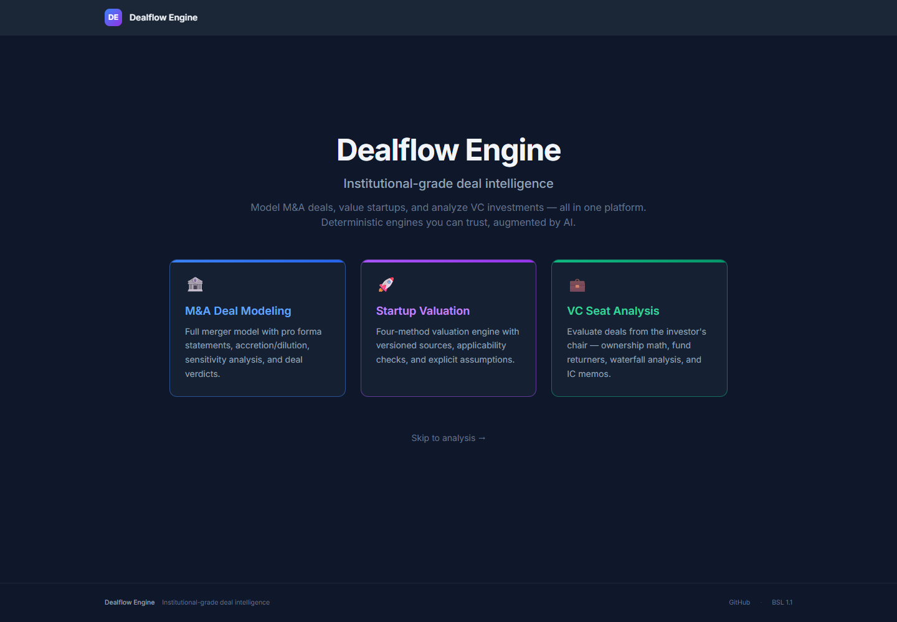

# Dealflow Engine

**Source-available deal intelligence platform. Financial modeling for M&A, startup valuation, and venture capital with visible evidence and assumptions.**

[](LICENSE)
[](https://python.org)
[](https://react.dev)
[](https://fastapi.tiangolo.com)

---



*The application running locally, September 2026.*

## What This Is

Dealflow Engine is a unified platform that covers the three core activities in private-market deal-making:

1. **M&A Deal Modeling** — Full merger model with pro forma statements, sources & uses, contribution analysis, credit metrics, implied valuation multiples, deal returns transparency, PPA, circularity solving, sensitivity analysis, and accretion/dilution verdicts. Includes a Defense & National Security vertical with defense-specific analytics.
2. **Startup Valuation** — Four-method valuation engine (Berkus, Scorecard, Risk Factor Summation, ARR Multiple) for pre-seed through Series A, with versioned observations and explicit assumptions across 13 verticals. Company evidence, model indication and actual ask/cap positioning are separate. AI scenarios adjust method parameters before blending.
3. **VC Fund-Seat Analysis** — Evaluate deals from the investor's chair: ownership math with full dilution stack, 3-scenario return modeling, waterfall analysis, pro-rata decisions, portfolio construction, QSBS eligibility, anti-dilution modeling, bridge round analysis, and auto-generated IC memo financials.

Each module runs a deterministic computation engine underneath. An optional Claude AI co-pilot augments the output with plain-English narratives, bear/base/bull investment theses, scenario explanations, and conversational deal entry — but the computed numbers are always the source of truth.

## September 2026 evidence release

Engine 2.0 uses immutable benchmark releases with record-level provenance, source/cohort checks and explicit assumption status. VC deals without revenue require explicit exit assumptions before return screening. Only specified future rounds dilute ownership; scenario proceeds bridge EV to equity and apply the investor's selected preferred class. Fund vintage quartiles are unavailable without a matching cohort. M&A earnings impact remains separate from strategic and valuation context.

See [benchmark sources, release workflow and model boundaries](docs/BENCHMARKS.md), [implementation and validation](docs/IMPLEMENTATION.md), and [the original plan](ENGINE_IMPROVEMENT_PLAN.md). The empirical outcome dataset is currently empty: passing synthetic tests does not establish market accuracy.

## Who It's For

- **Corporate development teams** evaluating acquisitions without $50K advisory models
- **Founders** pressure-testing their valuation ask before walking into an investor meeting
- **VC associates and partners** screening deals against fund economics and portfolio construction constraints
- **Finance students and analysts** learning institutional deal mechanics with a real computation engine, not static spreadsheet templates

## Quick Start

```bash
# Clone the repo
git clone https://github.com/bdavis37-tal/dealflow-engine.git
cd dealflow-engine

# Run with Docker (recommended)
docker compose up

# App is now running:
# Frontend: http://localhost:3000
# API docs:  http://localhost:8000/docs
```

No API keys, no accounts, no configuration required. AI features activate automatically when `ANTHROPIC_API_KEY` is set.

## Development Setup

### Backend (Python / FastAPI)

```bash
cd backend
pip install -e ".[dev]"

# Run the API server
uvicorn app.main:app --reload --port 8000

# Run tests
pytest tests/ -v
```

### Frontend (React / TypeScript)

```bash
cd frontend
npm install

# Start dev server (proxies /api to localhost:8000)
npm run dev

# Type-check
npm run typecheck

# Run tests
npm test
```

## Architecture

```
dealflow-engine/
├── backend/
│   ├── app/
│   │   ├── main.py                         # FastAPI app + CORS
│   │   ├── api/
│   │   │   ├── routes.py                   # /api/v1/* — M&A endpoints
│   │   │   ├── ai_routes.py                # /api/ai/* — AI co-pilot endpoints
│   │   │   ├── startup_routes.py           # /api/startup/* — Startup valuation
│   │   │   └── vc_routes.py                # /api/vc/* — VC fund-seat analysis
│   │   ├── engine/
│   │   │   ├── models.py                   # M&A Pydantic models (source of truth)
│   │   │   ├── financial_engine.py         # M&A orchestrator: run_deal()
│   │   │   ├── circularity_solver.py       # Debt/interest iterative solver
│   │   │   ├── purchase_price.py           # PPA & goodwill (ASC 805)
│   │   │   ├── sensitivity.py              # 2D sensitivity matrices
│   │   │   ├── returns.py                  # IRR / MOIC calculations
│   │   │   ├── risk_analyzer.py            # Automated risk flags
│   │   │   ├── defaults.py                 # Smart defaults engine
│   │   │   ├── startup_models.py           # Startup valuation Pydantic models
│   │   │   ├── startup_engine.py           # 4-method startup valuation engine
│   │   │   ├── vc_fund_models.py           # VC fund-seat Pydantic models
│   │   │   └── vc_return_engine.py         # VC return/ownership/waterfall engine
│   │   ├── services/
│   │   │   └── ai_service.py               # Claude API client, caching, streaming
│   │   └── data/
│   │       ├── industry_benchmarks.json    # 20 M&A industry verticals
│   │       ├── startup_valuation_benchmarks.json  # 13 startup verticals × 3 stages
│   │       └── vc_benchmarks.json          # VC stage transitions, fund construction, exit data
│   └── tests/
│       ├── test_engine.py
│       ├── test_circularity.py
│       ├── test_sensitivity.py
│       └── fixtures/                       # Known input/output pairs
│
└── frontend/
    └── src/
        ├── App.tsx                         # Mode selector + route orchestrator (landing | ma | startup | vc)
        ├── types/
        │   ├── deal.ts                     # M&A TypeScript types
        │   ├── startup.ts                  # Startup valuation types
        │   └── vc.ts                       # VC fund-seat types
        ├── hooks/
        │   ├── useDealState.ts             # M&A state + localStorage
        │   ├── useStartupState.ts          # Startup valuation state
        │   └── useVCState.ts               # VC fund-seat state
        ├── lib/
        │   ├── api.ts                      # M&A + startup API calls
        │   ├── ai-api.ts                   # AI streaming (SSE)
        │   ├── vc-api.ts                   # VC API calls
        │   └── formatters.ts               # Currency, pct, multiple formatters
        ├── components/
        │   ├── flow/                       # M&A 6-step guided input
        │   │   └── startup/                # Startup 4-step input flow
        │   ├── output/                     # M&A results dashboard
        │   │   └── startup/                # Startup valuation dashboard
        │   ├── vc/                         # VC fund setup, deal screen, dashboard,
        │   │                               #   waterfall, ownership, governance, IC memo
        │   ├── inputs/                     # Reusable form components
        │   ├── layout/                     # AppShell, LandingPage, StepIndicator, ModeToggle
        │   └── shared/                     # MetricCard, HeatmapCell, AIBadge, StreamingText
        └── styles/globals.css
```

## The Three Engines

### M&A Deal Model

Full acquisition analysis engine. Takes buyer + target financials, financing structure, PPA assumptions, and synergy estimates. Returns:

- Sources & uses of funds table — full deal financing breakdown at close
- 5-year pro forma income statements with iteratively solved interest expense and isolated one-time costs
- Purchase price allocation (ASC 805) with goodwill and incremental D&A
- Contribution analysis — what each company contributes to the combined entity
- Credit metrics — post-close leverage ratios: Total Debt/EBITDA, Net Debt/EBITDA, Interest Coverage, Fixed Charge Coverage, Debt/Total Cap
- Implied valuation multiples — EV/Revenue, EV/EBITDA (LTM and NTM), P/E
- Deal returns transparency — equity check at close, FCF to equity schedule, IRR/MOIC matrix
- Accretion/dilution analysis with EPS bridge breakdown
- Three 2D sensitivity matrices with base case highlighting and absolute axis labels
- Six automated risk flags with severity ratings
- Deal scorecard with verdict: green (accretive), yellow (marginal), red (dilutive)

Supported industry verticals include **Defense & National Security**, with defense-specific analytics: clearance level premiums, contract vehicle tracking, programs of record, backlog coverage ratio, revenue visibility, stacking premiums (clearance + certification + POR), and DoD concentration risk checks.

```python
from app.engine import run_deal
from app.engine.models import DealInput

result = run_deal(deal_input)
print(result.deal_verdict_headline)
# "This deal is accretive to earnings by 8.2% in Year 1"
```

### Startup Valuation

Four-method valuation engine for pre-seed through Series A startups across 13 verticals:

**AI/ML Infrastructure** · **AI-Enabled SaaS** · **B2B SaaS** · **Fintech** · **Healthtech** · **Biotech/Pharma** · **Deep Tech/Hardware** · **Consumer** · **Climate/Energy** · **Marketplace** · **Vertical SaaS** · **Developer Tools** · **Defense Tech / National Security**

Each vertical has versioned reference bands, ARR-multiple assumptions and traction assumptions. Inherited cells lack sufficient per-metric sourcing and are explicitly labeled assumptions; selected new observations have linked primary sources. Pre-revenue methods use the same-stage vertical baseline, with an explicit same-stage market fallback where available.

- **Berkus Method** — Qualitative factor scoring (idea, team, prototype, relationships, rollout)
- **Scorecard Method** — Team, market, product, traction, competition weighted against stage medians
- **Risk Factor Summation** — 12 risk categories adjusted from a vertical-specific base valuation
- **ARR Multiple** — Applicable recurring-software revenue multiples with growth, retention and margin adjustments; excluded for non-recurring business models

Output includes a model-indicated pre-money value and method-dispersion range, transparent method contributions, explicit SAFE-cap mechanics and a separate actual-price assessment. No ask or compatible reference means price is not assessed. Future-round assumptions can imply down rounds.

**Sensitivity analysis** — Tornado chart showing how key inputs (ARR, MoM growth, NRR, TAM, raise amount, repeat founder status) move the valuation needle. Runs the engine multiple times with perturbed inputs and ranks by impact, identifying the single most impactful lever for each startup.

**AI parameter scenarios** adjust scorecard weights, Berkus caps, risk steps and applicable ARR multiples before blending. The AI-specific verticals (including defense) receive no additional overlay. These parameters are assumptions, not empirically calibrated premiums. No post-blend multiplier or hidden early-revenue floor is applied.


### VC Fund-Seat Analysis

Evaluates any deal from the investor's perspective, anchored to fund economics:

- **Ownership math** — Entry through exit ownership after explicitly selected future financing rounds and incremental pools
- **3-scenario return model** — Bear/base/bull with probability-weighted expected MOIC and IRR
- **Waterfall analysis** — Liquidation preference distribution through a multi-class cap table
- **Pro-rata decision modeling** — Exercise vs. pass expected value comparison
- **Portfolio construction** — TVPI/DPI/RVPI, concentration analysis, reserve adequacy
- **GP carry economics** — Full fund waterfall (return of capital → hurdle → catch-up → carry split), per-GP compensation, clawback exposure, European vs. American waterfall
- **Fund-level IRR & J-curve** — Irregular cashflows, J-curve data, gross and net IRR; vintage quartiles remain unavailable without a matched cohort
- **SAFE conversion modeling** — Multi-SAFE stack conversion at a priced round with cap vs. discount determination, MFN clause application, post-money vs. pre-money mechanics, and full post-conversion cap table
- **Deal comparison** — Side-by-side evaluation of multiple deals with rankings on MOIC, IRR, ownership, and fund returner metrics
- **QSBS eligibility** — IRC §1202 tax benefit estimation, including 2025 $15M cap changes
- **Anti-dilution modeling** — Full ratchet vs. broad-based weighted average in down rounds
- **Bridge round analysis** — Dilution impact and participation recommendation
- **IC memo auto-generation** — Financial section with investment thesis prompt
- **Quick screen** — pass / look_deeper / strong_interest / insufficient_inputs, conditional on scenario assumptions

## API Reference

The backend exposes five route groups:

```
# M&A
POST /api/v1/analyze          — Run M&A deal model (DealInput → DealOutput)
GET  /api/v1/defaults         — Smart defaults for industry + deal size
GET  /api/v1/industries       — List supported M&A industry verticals
GET  /api/v1/health           — Health check

# Benchmark releases
GET  /api/benchmarks/releases — Available immutable releases
GET  /api/benchmarks/{version} — Release summary and source gaps
GET  /api/benchmarks/{version}/vc-defaults — Versioned dilution defaults

# Startup Valuation
POST /api/startup/value       — Run startup valuation engine
POST /api/startup/sensitivity — Sensitivity analysis (tornado chart)
GET  /api/startup/benchmarks  — Benchmark data by vertical + stage
GET  /api/startup/verticals   — List startup verticals
GET  /api/startup/stages      — List funding stages

# VC Fund-Seat
POST /api/vc/evaluate         — Full deal evaluation from fund seat
POST /api/vc/portfolio        — Portfolio construction analysis
POST /api/vc/waterfall        — Liquidation preference waterfall
POST /api/vc/pro-rata         — Pro-rata exercise analysis
POST /api/vc/compare          — Side-by-side deal comparison
POST /api/vc/gp-carry         — GP carry economics & fund waterfall
POST /api/vc/fund-irr         — Fund-level IRR & J-curve
POST /api/vc/safe-conversion  — SAFE stack conversion modeling
POST /api/vc/qsbs             — QSBS eligibility check (IRC §1202)
POST /api/vc/anti-dilution    — Down-round anti-dilution modeling
POST /api/vc/bridge           — Bridge/extension round analysis
GET  /api/vc/fund/defaults    — Fund profile defaults by size
GET  /api/vc/benchmarks       — VC benchmarks by vertical + stage
GET  /api/vc/verticals        — List VC-supported verticals
GET  /api/vc/stages           — List investment stages
GET  /api/vc/health           — VC engine health check

# AI Co-pilot
GET  /api/ai/status           — AI availability check
POST /api/ai/parse-deal       — Natural language deal parsing
POST /api/ai/generate-narrative — M&A deal narrative generation
POST /api/ai/startup-narrative — Startup valuation narrative
POST /api/ai/vc-narrative     — VC bear/base/bull investment thesis
POST /api/ai/chat             — M&A streaming chat (SSE)
POST /api/ai/vc-chat          — VC deal co-pilot chat (SSE)
POST /api/ai/scenario-narrative — Scenario explanation (SSE)
POST /api/ai/explain-field    — Field-level help

GET  /docs                    — Interactive Swagger documentation
```

## Tech Stack

| Layer | Technology |
|-------|-----------|
| Frontend | React 18, TypeScript, Vite, TailwindCSS |
| Charts | Recharts |
| UI Components | Radix UI primitives |
| Backend | Python 3.11–3.12, FastAPI, Pydantic v2 |
| AI Co-pilot | Claude (Anthropic API), streaming SSE |
| Testing | pytest (678 tests), Vitest (27 tests), benchmark validation and synthetic impact reports |
| Deployment | Docker, docker-compose |

## Contributing

This is a build-in-public project. Contributions are welcome.

**Code standards:**
- Python: type annotations on all functions, docstrings on all public APIs
- TypeScript: strict mode, no `any`
- Financial formulas: comment explaining the finance logic, not just the code
- Tests: every new computation module needs test coverage

**To contribute:**
1. Fork the repo
2. Create a feature branch: `git checkout -b feature/your-feature`
3. Write code + tests
4. Open a PR with a clear description of what you changed and why

**Priority contribution areas:**
- Export to Excel (structured workbook with tabs per module)
- PDF report generation (board-ready briefings, IC memos)
- Additional startup verticals and VC benchmark data
- Live market data integration (public company financials)
- Multi-target (roll-up) M&A modeling
- LBO modeling mode (pure PE returns analysis)

## Roadmap

- [x] GP carry economics (European/American waterfall, catch-up, clawback)
- [x] Fund-level IRR & J-curve (Newton-Raphson solver)
- [x] SAFE conversion modeling (multi-SAFE stack, cap/discount/MFN)
- [x] Deal comparison engine (multi-deal side-by-side ranking)
- [x] Startup sensitivity analysis (tornado chart)
- [x] VC AI co-pilot (bear/base/bull thesis narrative, streaming chat)
- [ ] LP reporting dashboard (quarterly statements, DPI/TVPI time series)
- [ ] Secondary market transaction modeling
- [ ] Co-investment / SPV structuring
- [ ] Fund-of-funds / LP portfolio construction
- [ ] Live market data integration (pull public company financials automatically)
- [ ] Multi-target (roll-up) M&A modeling
- [ ] Cross-border / multi-currency deals
- [ ] User accounts + deal history
- [x] Versioned share links with input and evidence identity
- [ ] Real-time collaborative editing
- [ ] Excel export (structured workbook with tabs)
- [x] Startup PDF report and VC text memo exports with evidence context
- [ ] M&A PDF briefing and VC PDF memo
- [ ] LBO modeling mode (pure PE returns analysis)
- [ ] Comparable transaction database
- [ ] Convertible notes and preferred equity in M&A structures

## License

This project is licensed under the [Business Source License 1.1](LICENSE) (BSL 1.1).

The code is source-available — anyone can view, fork, run it locally, and modify it for personal or internal use. Commercial use (selling the software, offering it as a hosted service, or embedding it in a commercial product) requires a separate commercial license; contact [brendan@incertaintel.ai](mailto:brendan@incertaintel.ai) for licensing inquiries. On February 23, 2030 (four years from the initial release), the license automatically converts to Apache 2.0 and the code becomes fully open source. This model is used by companies like HashiCorp, Sentry, CockroachDB, and MariaDB.

---

*Built in public. Star the repo if you find it useful.*
